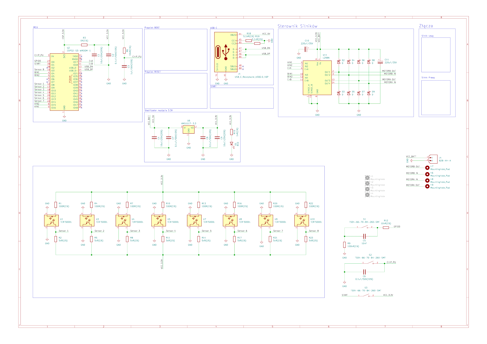
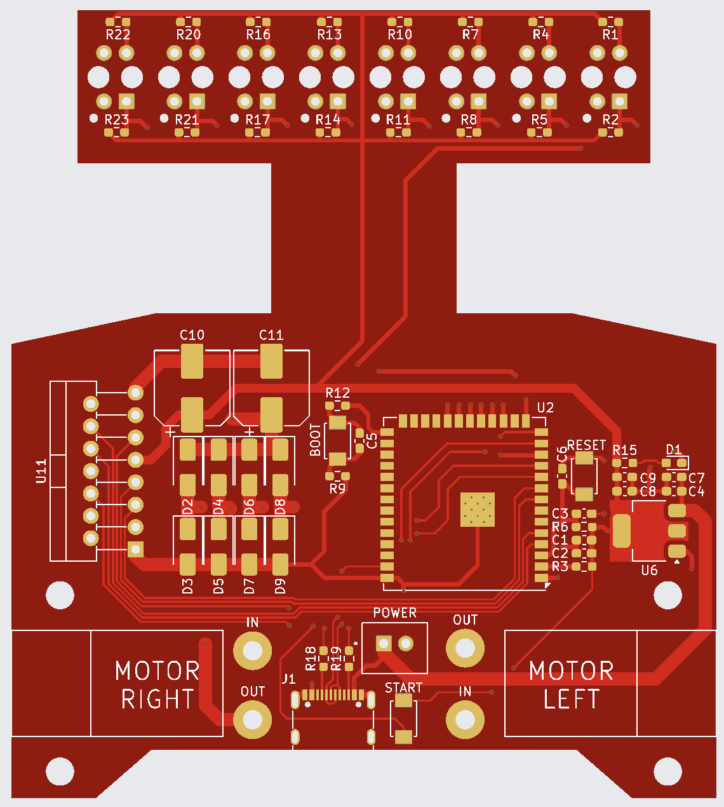
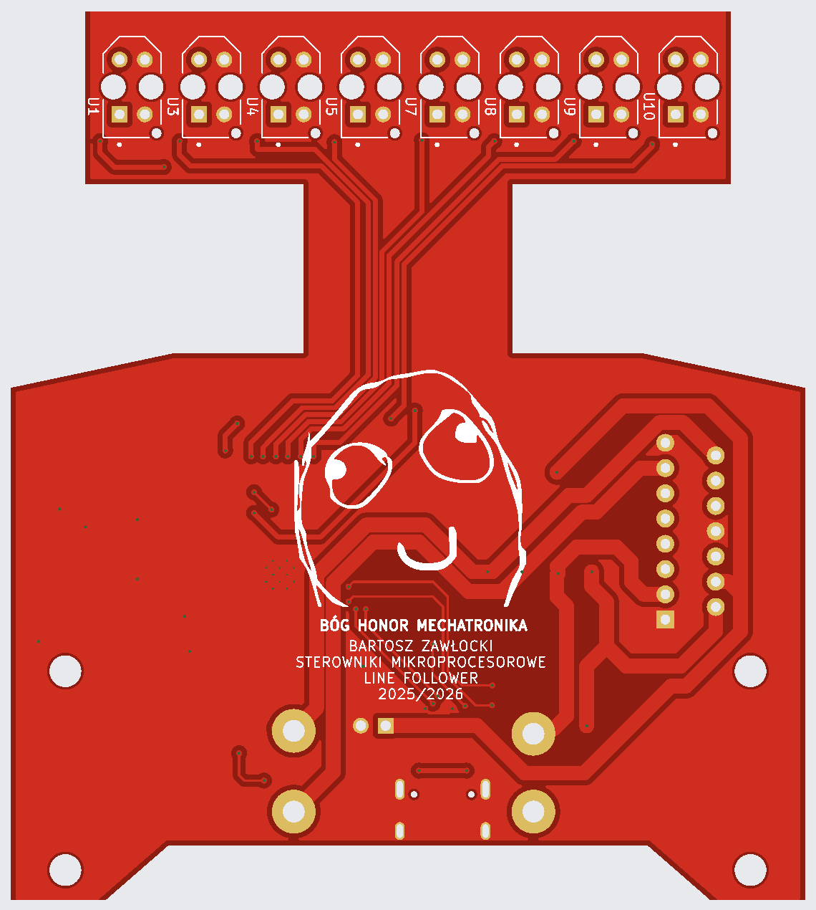

Projekt z przedmiotu **Sterowniki mikroprocesorowe** (Mechatronika, 5. semestr). Założeniem było samodzielne zaprojektowanie i wykonanie **płytki PCB** oraz napisanie oprogramowania **opartego na rejestrach mikrokontrolera** dla szybkiego robota typu Line Follower sterowanego **algorytmem PD**.

Robot porusza się wzdłuż czarnej linii na jasnym tle. Osiem czujników odbiciowych IR mierzy położenie linii, mikrokontroler liczy odchylenie, a regulator PD koryguje prędkość obu silników. Program uruchamia się przyciskiem START, a do programowania służy złącze USB-C.

## Elektronika

Płytkę zaprojektowałem w **KiCad** — od schematu ideowego po dwuwarstwowe PCB z listwą czujników wysuniętą przed koła.

- **MCU:** ESP32-S3-WROOM-1U, programowanie przez USB-C (z zabezpieczeniem ESD),
- **Czujniki:** 8 × TCRT5000L (dioda IR + fototranzystor) na wejściach ADC1 i ADC2,
- **Napęd:** mostek H **L298N** z diodami Schottky, sterowanie PWM 20 kHz, dwa silniki DC,
- **Zasilanie:** pakiet 18650 (10,8 V) przez złącze JST, stabilizator AMS1117-3.3,
- **Przyciski:** START, RESET i BOOT.



| Warstwa górna                                        | Warstwa dolna                                       |
| ---------------------------------------------------- | --------------------------------------------------- |
|           |           |

### Obliczenia

Wartości elementów dobrałem obliczeniowo — np. rezystor diody IR: (3,3 V − 1,25 V) / 20 mA ≈ 102 Ω → **100 Ω**, prąd 20,5 mA i moc 42 mW, poniżej 62 mW dopuszczalnych dla obudowy 0603. Przy kołach o średnicy 37 mm i silnikach 1000 obr/min teoretyczna prędkość robota to **ok. 1,94 m/s**.

## Oprogramowanie

Program w C/C++ korzysta bezpośrednio z drajwerów ESP-IDF i rejestrów GPIO zamiast wysokopoziomowych funkcji Arduino:

- szybkie ustawianie pinów makrami na rejestrach `GPIO.out_w1ts` / `GPIO.out_w1tc`,
- PWM na kontrolerze **LEDC** (20 kHz, 8 bitów) dla wejść enable mostka H,
- odczyt 8 czujników z **ADC1 i ADC2**, ważona średnia pozycji linii jako błąd regulacji,
- **regulator PD** (Kp = 1,8, Kd = 0,6), osobna obsługa zakrętów 90° przez skrajne czujniki,
- „kick start” na pełnej mocy przy ruszaniu i zatrzymanie po 3 s bez wykrytej linii.

```cpp
int blad = policzBlad();
int pochodna = blad - ostatni_blad;
ostatni_blad = blad;
int korekta = Kp * blad + Kd * pochodna;
int predkosc_lewa  = constrain(PREDKOSC_BAZOWA + korekta, PREDKOSC_MIN, PREDKOSC_MAX);
int predkosc_prawa = constrain(PREDKOSC_BAZOWA - korekta, PREDKOSC_MIN, PREDKOSC_MAX);
ustawPredkosc(predkosc_prawa, predkosc_lewa);
```

## Wnioski

Po testach spisałem, co poprawiłbym w kolejnej wersji:

- **Czujniki** — rozstaw ok. 80 mm powodował gubienie linii na ostrych zakrętach; nieparzysta liczba czujników dałaby dokładniejsze pozycjonowanie.
- **Rozkład masy** — cięższe elementy, jak mostek H, lepiej przenieść do tyłu płytki; akumulatory najlepiej działały z tyłu obudowy.
- **Koła** — drukowane koła miały za małą przyczepność (tymczasowo owinięte taśmą); docelowo opony z odlewu silikonowego.
- **Serwis** — brak złącza UART wymuszał podłączanie się bezpośrednio do płytki.
- **Napęd** — silniki o większym momencie ułatwiłyby ruszanie.
