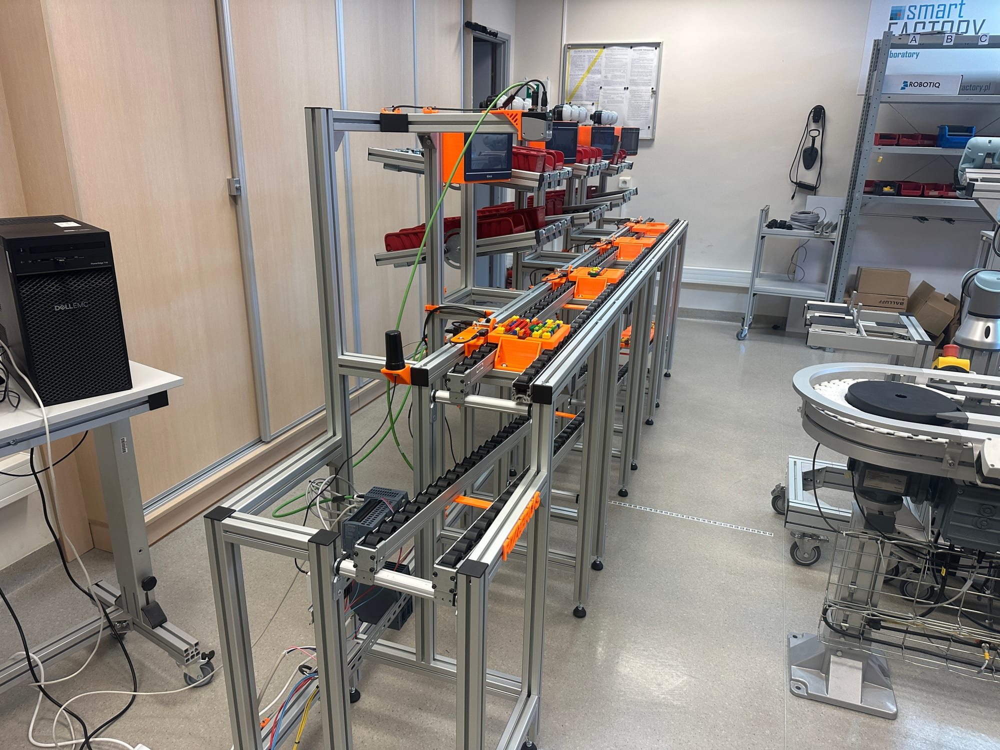
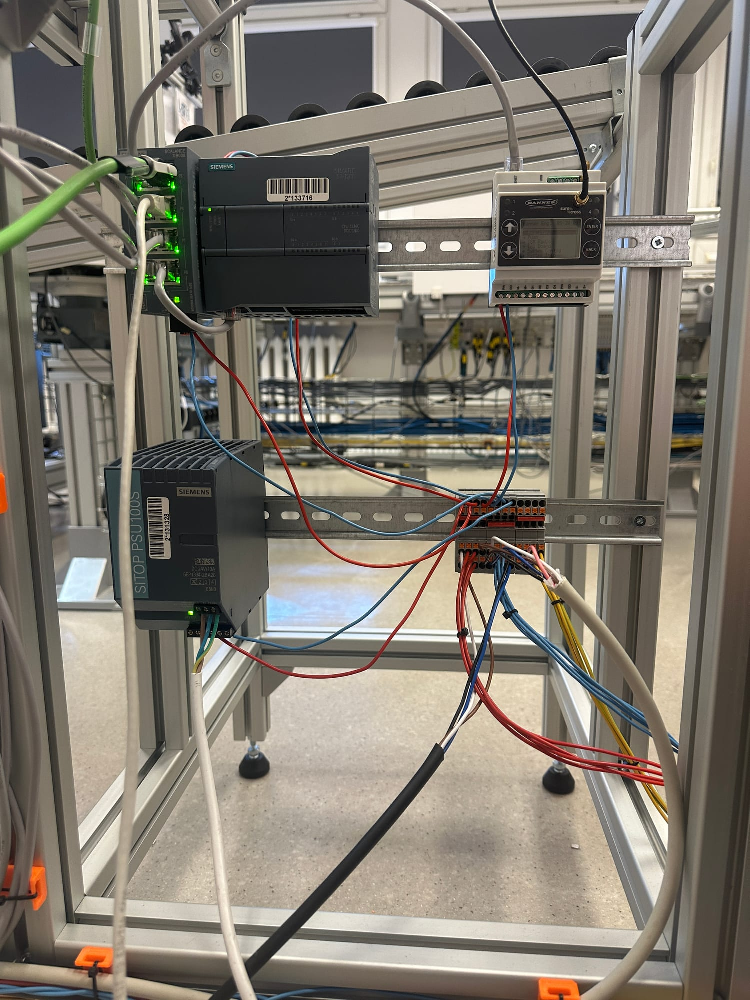
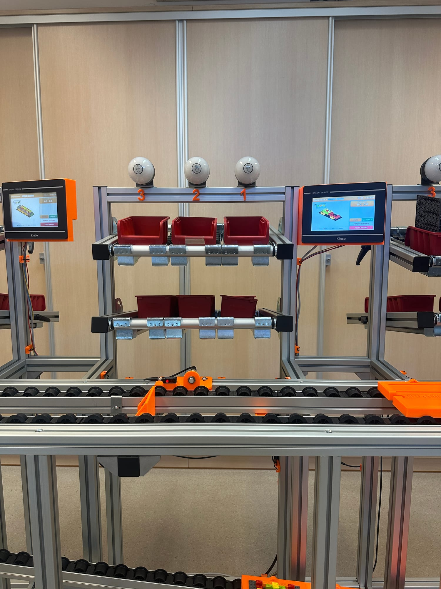
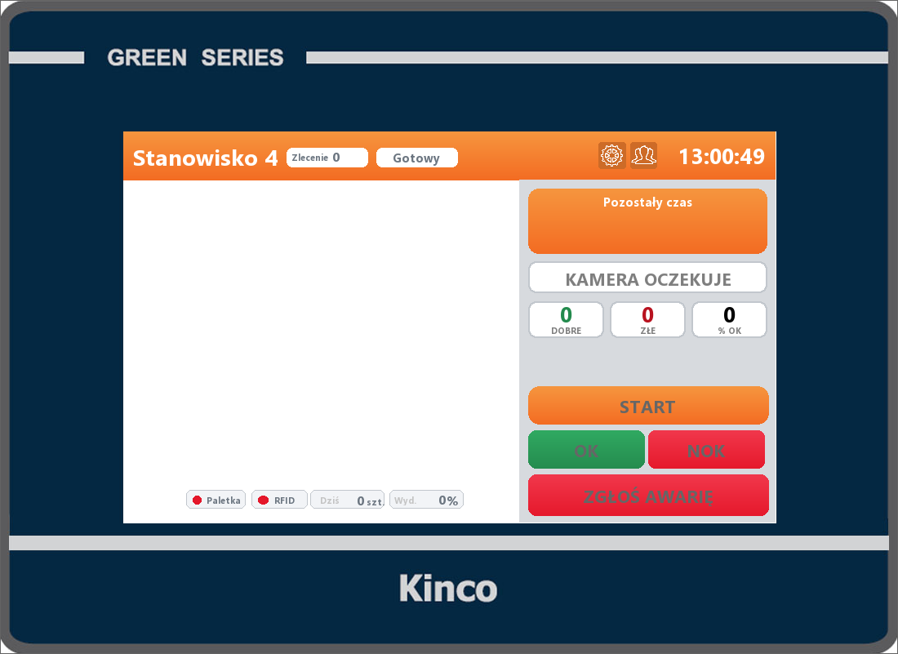
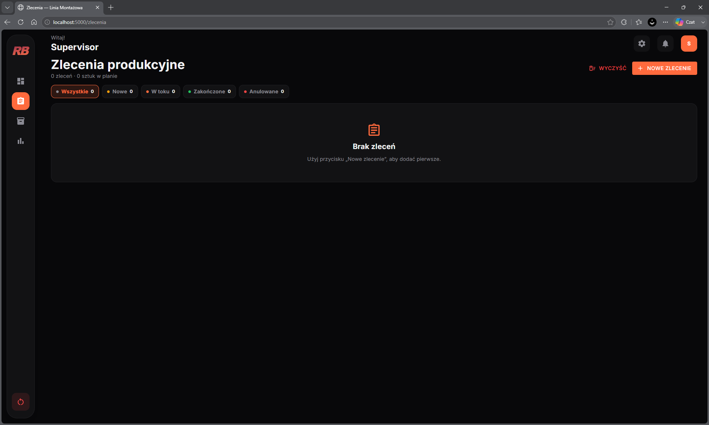
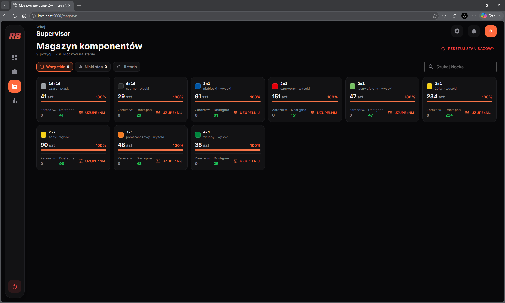
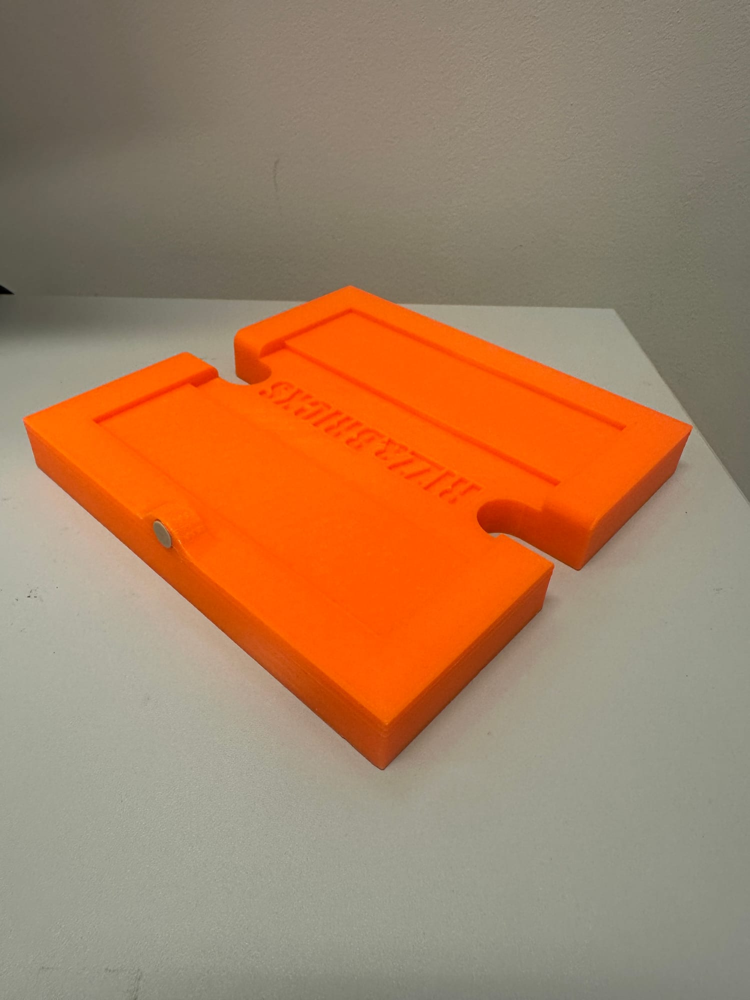

Zautomatyzowana linia montażowa modeli LEGO z trzema stanowiskami montażowymi i stanowiskiem kontroli jakości. Projekt łączy sterowanie PLC, panele operatorskie, identyfikację RFID, kontrolę wizyjną oraz nadrzędny system MES z bazą danych i aplikacją webową.

## Jak działa

Zlecenie utworzone na stronie trafia do sterownika. Paletka z tagiem RFID przechodzi kolejno przez trzy stanowiska montażowe i stanowisko QC. Wyniki — czasy cykli, braki, zużycie komponentów i OEE — wracają do bazy i są prezentowane na dashboardzie.

1. **Zlecenie** — tworzone w aplikacji webowej, z walidacją dostępności komponentów w magazynie.
2. **Stanowisko 1** — zapis numeru zlecenia i modelu na tagu RFID paletki.
3. **Stanowiska 2 i 3** — montaż według instrukcji na panelu HMI, pobieranie klocków z kontenerów Pick-to-Light.
4. **Stanowisko QC** — odczyt RFID, inspekcja kamerą i decyzja OK / NOK z podaniem powodu odrzutu.

## Warstwa PLC

Logika produkcyjna napisana w **SCL** na sterowniku **SIMATIC S7-1200**. Każde stanowisko to maszyna stanów (Gotowy → Montaż → Zakończono / Awaria) z odliczaniem czasu docelowego dla danego wyrobu.

- **RFID** — czytniki Balluff przez master IO-Link BNI XG3.
- **Pick-to-Light** — bramka Banner DXM700 odpytywana przez **Modbus TCP**; naciśnięcie przycisku zmniejsza licznik kontenera.
- **Kontrola wizyjna** — czujnik Balluff BVS nad paletką na stanowisku QC.

## Panele operatorskie (HMI)

Cztery panele — po jednym na stanowisko. Ekran roboczy pokazuje instrukcję montażu z rzutem modelu, licznik czasu i przyciski Start / Zakończ / Zgłoś awarię.

## System MES — middleware, baza i dashboard

- **Middleware (C#, S7.Net)** — odpytuje PLC co 200 ms, podaje kolejne zlecenia z kolejki SQL, rejestruje sztuki po QC i rozlicza zużycie komponentów. Przy starcie waliduje układ pamięci bloków danych, żeby po zmianie struktury nie zapisywać danych w złe miejsce.
- **Baza MS SQL** — wyroby, struktura BOM, technologia, zlecenia, magazyn; wyzwalacz po każdym cyklu liczy **OEE**, dostępność, wydajność, jakość i FTY.
- **Dashboard (Blazor)** — OEE na żywo, status stanowisk, zlecenia z priorytetami, magazyn komponentów i raporty.

## Konstrukcja mechaniczna

Rama z profili aluminiowych. Elementy zaprojektowane w ramach projektu i wydrukowane w 3D: paletki transportowe z gniazdem na tag RFID, uchwyty paneli HMI, podstawy czujników, mocowanie kamery, zderzaki pozycjonujące, organizery przewodów i oznaczenia stanowisk.

## Wyniki

| Parametr               | Wartość                         |
| ---------------------- | ------------------------------- |
| Stanowiska             | 3 montażowe + 1 kontroli jakości |
| Wyroby                 | 6 modeli LEGO                    |
| Czas cyklu             | 111–182 s na wyrób               |
| Pojemność kolejki PLC  | 200 zleceń                       |
| Urządzenia w sieci     | PLC, 4 × HMI, IO-Link, Pick-to-Light, kamera |
