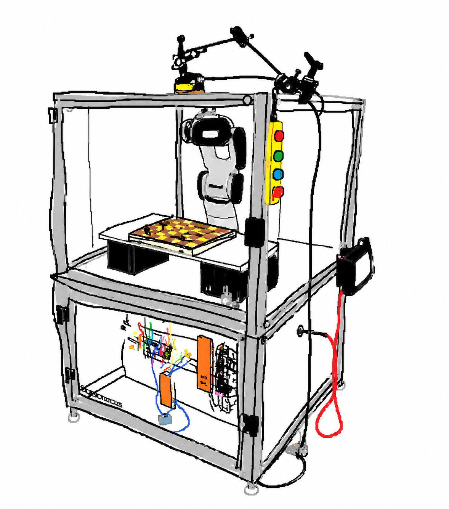
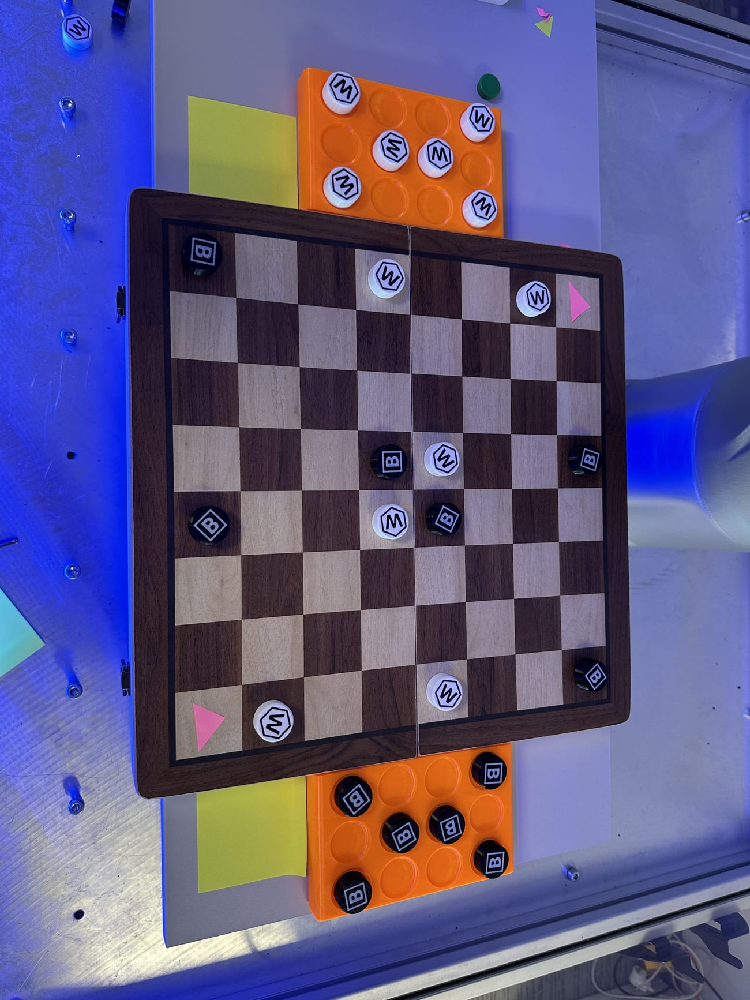
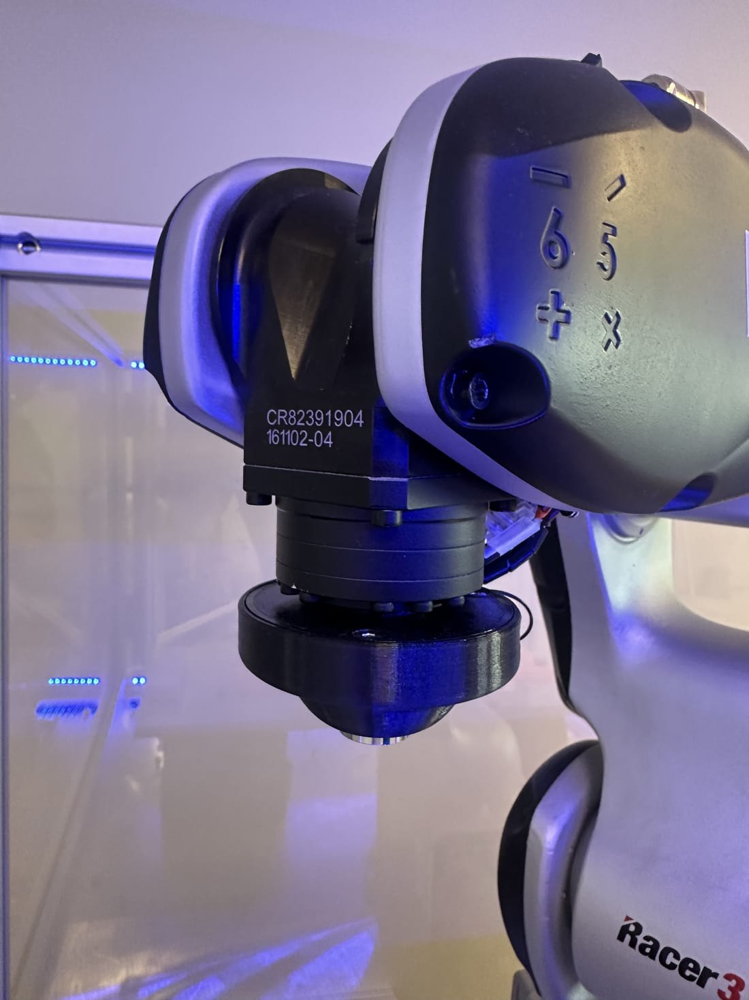
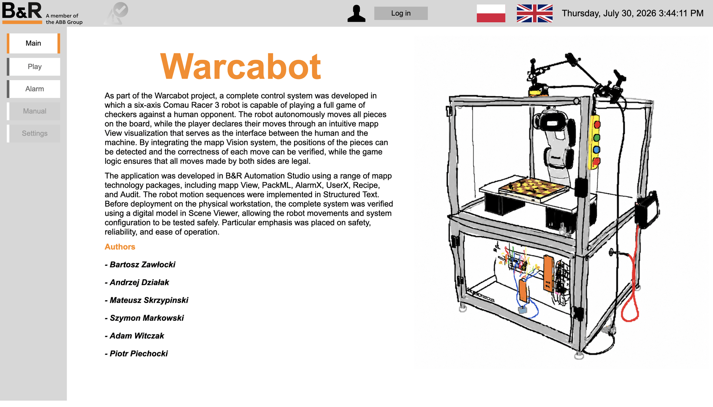
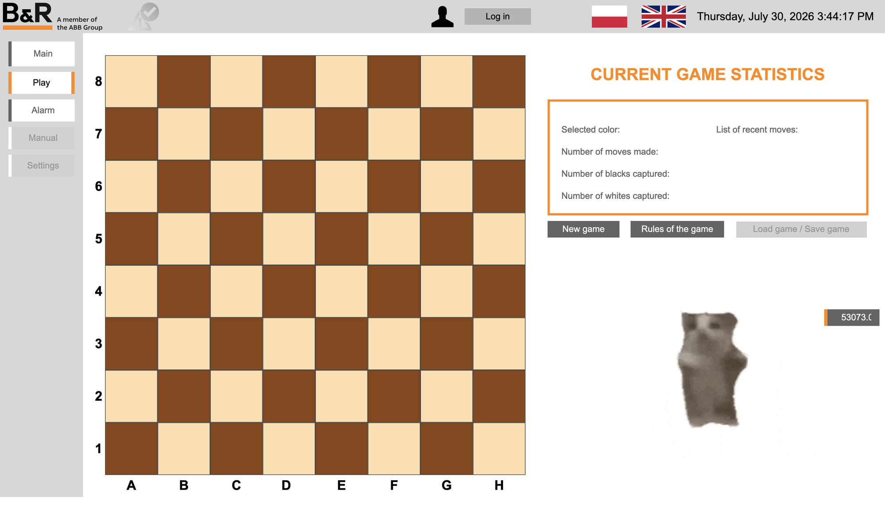
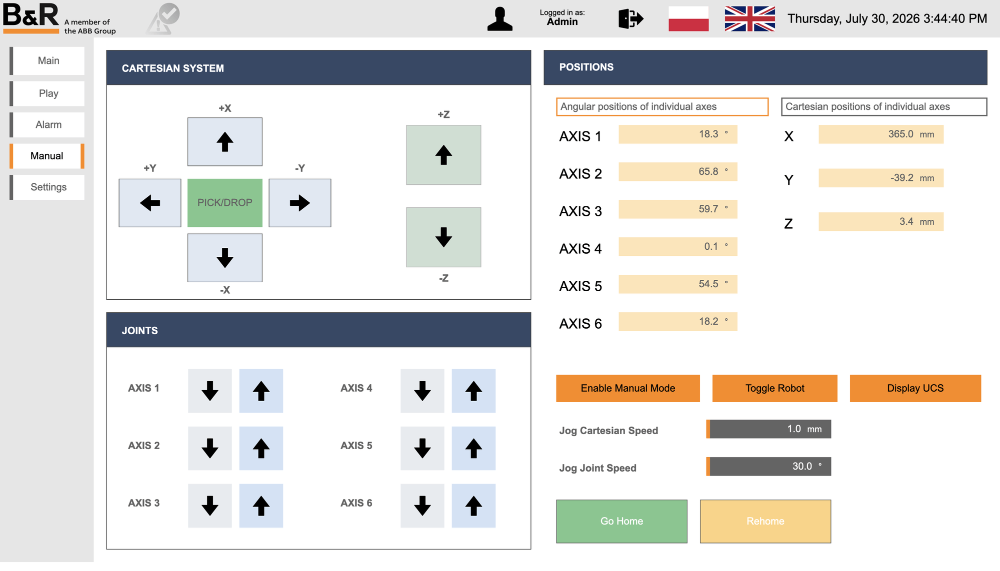
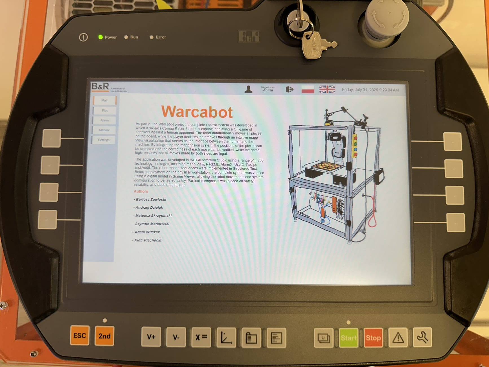
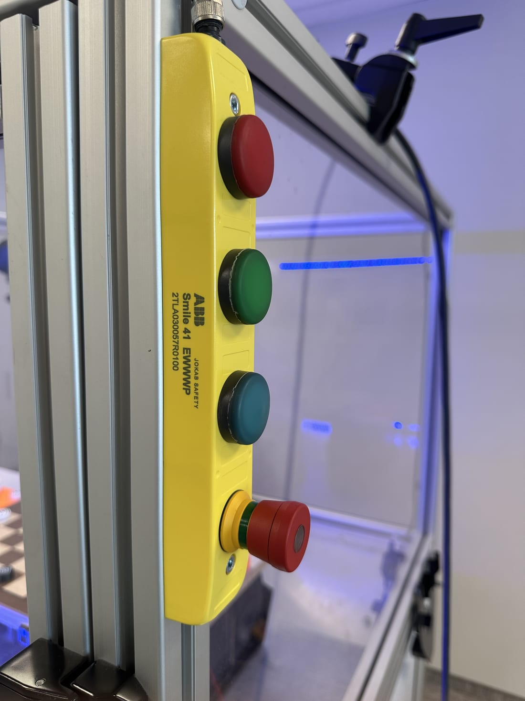
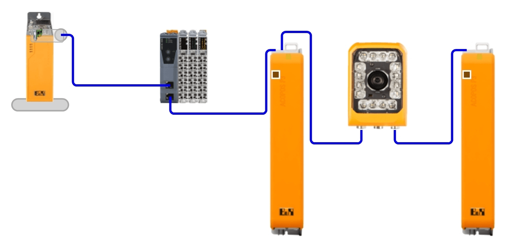
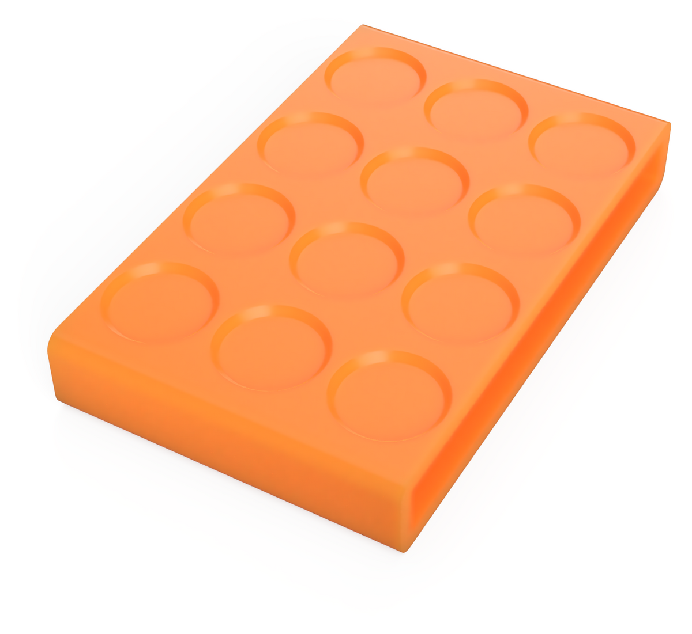

**Warcabot** to zautomatyzowane stanowisko, na którym sześcioosiowy robot przemysłowy **Comau Racer 3** rozgrywa pełną partię warcabów przeciwko człowiekowi. Gracz wybiera ruchy wyłącznie na dotykowym panelu, a wszystkie czynności fizyczne na planszy — przesuwanie pionków, bicie i odkładanie zbitych pionków do bufora — wykonuje robot. Kamera na bieżąco weryfikuje położenie pionków i poprawność każdego ruchu.

## Moja rola

Byłem **liderem 6-osobowego zespołu**. Zarządzałem całym workflow projektu: **przydzielałem zadania**, pilnowałem postępu prac i odpowiadałem za **łączenie kodu** poszczególnych członków zespołu w jedną działającą aplikację.

## Jak działa

Pojedynczy ruch przebiega w trzech krokach:

1. **Gracz wybiera ruch** na ekranie — podświetlane są tylko ruchy zgodne z regułami, zweryfikowane przez silnik warcabowy.
2. **Kamera sprawdza planszę** — robi zdjęcie i porównuje rzeczywiste pionki z logicznym stanem gry.
3. **Robot wykonuje ruch** — podnosi pionek chwytakiem magnetycznym, przenosi go na pole docelowe, a zbite pionki odkłada do bufora obok planszy.

## Sterowanie i ruch robota

Aplikacja działa na komputerze panelowym **B&R** w **Automation Studio** z pakietami **mapp Technology**. Jest modularna — każda funkcja to osobne zadanie cykliczne:

- **MotionCtrl** — automat stanów robota: załączenie, bazowanie, tryb ręczny, wykonanie ruchu.
- **MainProgram** — główny automat gry: weryfikacja planszy, sterowanie krokami, sekwencja bicia.
- **camera / CheckVision** — akwizycja obrazu, mapowanie pionków na pola i porównanie ze stanem gry.
- **GameStats, SaveGame, AlarmHistory** — historia ruchów, zapis i wczytanie gry, historia alarmów.

Sekwencje ruchu robota napisane w **Structured Text (ST Motion)** — przeniesienie pionka z bezpiecznym podejściem pionowym i powrót do bazy. Przed testami na fizycznym robocie cały system sprawdzono na modelu cyfrowym celi w **Scene Viewer**.

## Silnik warcabowy (AI)

Logikę gry zapewnia osobny [silnik warcabowy](https://github.com/dashin2004/Checkers-Engine-Warcbot): rdzeń w **C** skompilowany do rozszerzenia Pythona i warstwa sterująca w **Pythonie**, połączona ze sterownikiem przez szyfrowany kanał **OPC UA**.

- reprezentacja planszy jako **bitboard** i przeszukiwanie **negamax z alfa-beta**,
- tablica transpozycji, ruchy zabójcze, ręcznie strojona funkcja oceny i księga otwarć,
- **5 poziomów trudności** — od 1-ply po 15-ply, plus tryb „troll” (najgorszy ruch) i losowy.

## Panel operatorski (mapp View)

Wizualizacja jest jedynym interfejsem człowiek–maszyna: ekran główny, interaktywna plansza 8×8 ze statystykami, alarmy, tryb ręczny robota (jog osiowy i kartezjański) oraz ustawienia chronione logowaniem. Panel obsługuje język polski i angielski.

## Sprzęt i bezpieczeństwo

| Moduł                  | Typ                          |
| ---------------------- | ---------------------------- |
| Komputer panelowy / PLC | B&R 5APC3100.KBU1-000       |
| Robot 6-osiowy         | Comau Racer 3                |
| Kamera                 | B&R mapp Vision VSS112Q22    |
| Napędy                 | ACOPOS 8EI (POWERLINK)       |
| Wejścia / wyjścia      | X20 — Safety, chwytak        |

Stanowisko monitoruje przestrzeń roboczą i osie, obsługuje **E-STOP** i pozwala wznowić grę po resecie Safety bez ponownego uruchamiania maszyny. Usługi mapp zapewniają alarmy (AlarmX), zapis gry (Recipe), audyt i zarządzanie użytkownikami.

## Zespół

Bartosz Zawłocki · Andrzej Działak · Mateusz Skrzypiński · Szymon Markowski · Adam Witczak · Piotr Piechocki
